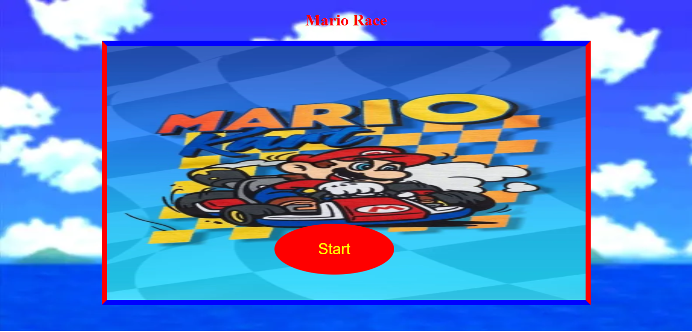
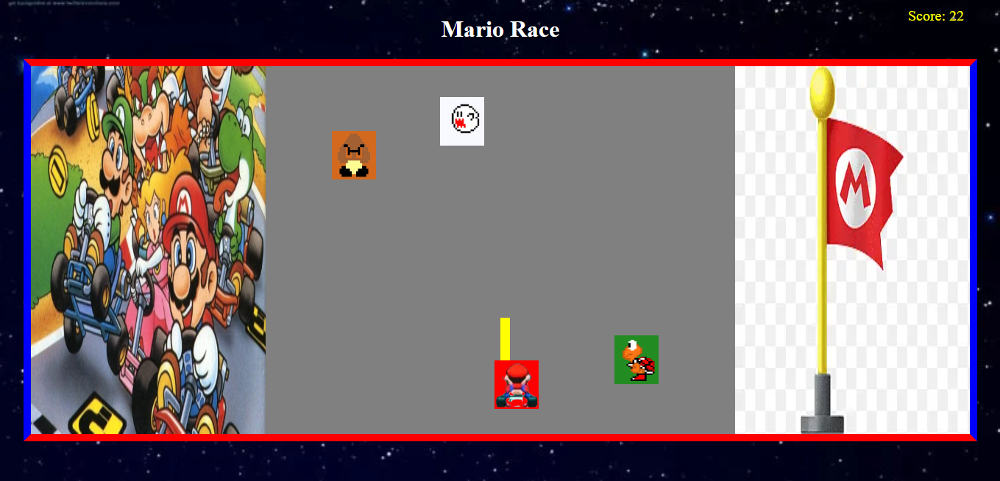

<h1>🏁 Mario Race</h1>

<strong>Mario Race</strong> é um jogo simples desenvolvido em <strong>JavaScript puro</strong>, onde o jogador controla um <strong>carrinho do Mario</strong> que deve desviar de inimigos caindo pela tela.
O projeto foi criado com o intuito de <strong>praticar lógica</strong>, <strong>manipulação dinâmica do DOM</strong> e <strong>criação de elementos HTML e CSS diretamente via JavaScript</strong>.

<h3>🚀 Demonstração</h3>

🎮 <a target="_blank" href="https://caiosribeirojp.com/mariorace/"><u>Jogar agora</u></a>

<strong>📸 Prévia do jogo:</strong>

<div align="center">
🏁 <strong>Tela Inicial</strong>
    <br><br>
    
    <br><br><br>
    <strong>🚗 Durante o Jogo</strong>
    <br><br>
    
</div>

<h3>🎮 Como o jogo funciona</h3>

<ul>

<li>Ao iniciar, o jogador é recebido com uma <strong>tela inicial</strong> que contém:</li>

<ul>

<li>Um <strong>botão “Começar”</strong></li>

<li><strong>Música de fundo</strong></li>

<li><strong>Som ao clicar no botão</strong></li>
</ul>
<li>Durante o jogo:</li>
<ul>
<li>O <strong>Mario</strong> se movimenta <strong>para a esquerda e direita</strong> usando o teclado ou tela do celular.</li>

<li><strong>Inimigos</strong> caem de cima para baixo na tela.</li>

<li>A cada segundo sobrevivido, o jogador ganha 1 ponto.</li>

<li>Se o Mario colidir com um inimigo:</li>
<ul>                           
<li>Um <strong>som de colisão</strong> é reproduzido.</li>

<li>O jogo <strong>para automaticamente</strong>.</li>

<li>Uma nova tela de início é exibida.</li>
</ul>    
</ul>

<li>Tanto na tela inicial quanto durante a partida há <strong>trilha sonora</strong>, controlada via JavaScript.</li>
</ul>

<h3>⚙️ Tecnologias Utilizadas</h3>
<ul>

<li><strong>JavaScript (puro)</strong></li>

<ul>

<li>Criação dinâmica de elementos HTML (<span style="background-color: black;">document.createElement</span>)</li>

<li>Estilização via propriedades CSS diretamente no JS (<span style="background-color: black;">element.style</span>)</li>

<li>Manipulação de eventos (<span style="background-color: black;">keydown, click, collision detection</span>)</li>

<li>Controle de sons e trilhas (<span style="background-color: black;">Audio()</span>)</li>
</ul>
<li>💡 Todo o jogo foi desenvolvido <strong>sem uso de frameworks ou bibliotecas externas</strong>, reforçando o aprendizado em <strong>lógica de programação</strong> e <strong>DOM puro</strong>.</li>
</ul>

<h3>🧠 Conceitos Praticados</h3>
<ul>
<li>Manipulação do <strong>DOM</strong> em tempo real</li>

<li><strong>Criação e remoção dinâmica</strong> de elementos</li>

<li><strong>Detecção de colisão</strong> entre objetos</li>

<li><strong>Controle de tempo e pontuação</strong></li>

<li>Uso de <strong>áudio</strong> no navegador</li>

<li><strong>Estruturação lógica</strong> de estados de jogo (início, execução, fim)</li>
</ul>

<h3>🚀 Como Executar o Projeto</h3>
<ol>
<li><strong>Clone este repositório:</strong>

```bash
git clone https://github.com/seuusuario/mario-race.git
```
</li>

<li><strong>Entre na pasta do projeto:</strong>

```bash
cd mario-race
```
</li>

<li><strong>Abra o arquivo</strong> <span style="background-color: black;">index.html</span> no seu navegador
<br>
<i>(ou use a extensão <strong>Live Server</strong> no VS Code)</i></li>
</ol>
<h3>📌 Status do Projeto</h3>

<strong>✅ Finalizado</strong>
<br>
<i>(Criado com fins de prática e aprimoramento de lógica em JavaScript puro.)</i>

<h3>👨‍💻 Autor</h3>

Desenvolvido por <a href="https://www.linkedin.com/in/caiosribeirojp/"><u>Caio Ribeiro</u></a>

📧 <u>caiosribeiro@bol.com.br</u>

🐙 <a href="github.com/CaiosribeiroJP"><u>github.com/CaiosribeiroJP</u></a>

<h3>🏷️ Licença</h3>

© 2025 <strong>CaiosribeiroJP</strong>
Este projeto foi criado para fins de estudo e portfólio.
Sinta-se à vontade para explorar o código e utilizá-lo como referência, mantendo os créditos ao autor.


